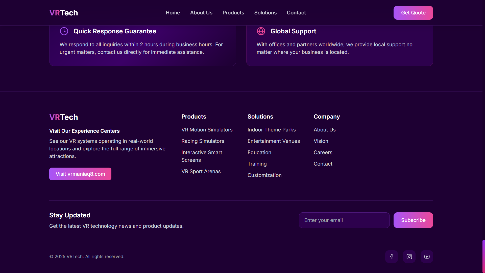

# 🌐 VR Tech Q8 Website


> An enterprise-grade, responsive website developed for **VR Tech Q8**, showcasing commercial VR simulators, immersive entertainment solutions, and global VR technology services.

---

# 📖 Project Overview

The **VR Tech Q8 Website** serves as the company's official digital platform, presenting its portfolio of VR simulators, immersive attractions, and business solutions for entertainment, education, and commercial sectors.

Designed with a modern, responsive interface, the website provides customers with an engaging experience while highlighting the company's expertise, products, global reach, and industry solutions.

The project was built with a focus on scalability, maintainability, multilingual support, and performance.

> **Note**
>
> The source code is proprietary and owned by **VR Tech Q8**. This repository is published exclusively as a portfolio showcase containing screenshots and project documentation.

---

# 🚀 Technologies

| Technology | Purpose |
|------------|---------|
| React 18 | Frontend Framework |
| TypeScript | Static Typing |
| Vite | Development & Build Tool |
| Tailwind CSS | Styling |
| React Router | Client-side Routing |
| i18next | Internationalization |
| React i18next | Localization |
| Express.js | Backend Services |
| Lucide React | Icons |
| ESLint | Code Quality |
| PostCSS | CSS Processing |
| Autoprefixer | Browser Compatibility |

---

# 🏗 Project Architecture

```text
VR TECH SITE
│
├── public/
│   ├── brochures/
│   ├── images/
│   └── products.json
│
├── src/
│   ├── components/
│   │   ├── Header.tsx
│   │   ├── Hero.tsx
│   │   ├── About.tsx
│   │   ├── Products.tsx
│   │   ├── Solutions.tsx
│   │   ├── Contact.tsx
│   │   └── Footer.tsx
│   │
│   ├── i18n/
│   │
│   ├── App.tsx
│   ├── main.tsx
│   └── index.css
│
├── package.json
├── vite.config.ts
└── README.md
```

---

# ✨ Features

- Fully Responsive Design
- Mobile-First Layout
- Modern Corporate User Interface
- Dynamic Product Catalog
- Downloadable Product Brochures
- Industry Solution Showcase
- Interactive Company Statistics
- Contact & Quote Request Section
- Experience Center Showcase
- Newsletter Subscription
- Component-Based Architecture
- Fast Loading Performance
- Optimized Production Build

---

# 🌍 Website Sections

- 🏠 Hero
- 🏢 About VRTech
- 💡 Core Values
- 🎯 Company Mission
- 🥽 VR Product Catalog
- 🏗 Industry Solutions
- ⭐ Why Choose VRTech
- 📞 Contact & Get Quote
- 🌍 Experience Centers
- 📧 Newsletter Subscription
- 📄 Footer

---

# 📸 Screenshots

## Home Page


---

## About VRTech


---

## Product Catalog


---

## Industry Solutions


---

## Contact Section


---

## Footer Section



---

## Mobile Experience


---

# 📦 Product Catalog

The website features a structured product catalog designed for commercial VR businesses.

Products include:

- VR Motion Simulators
- Racing Simulators
- Flying Simulators
- Interactive Smart Screens
- VR Sport Arenas
- Tracking Cinema
- Go Kart Systems
- Custom Entertainment Solutions

Each product can include downloadable brochures, specifications, and images managed through external JSON data.

---

# 🏢 Business Solutions

The platform highlights VRTech's solutions across multiple industries, including:

- Theme Parks
- Entertainment Centers
- Family Entertainment Centers (FEC)
- Educational Institutions
- Professional Training
- Commercial VR Installations

---

# 📊 Company Highlights

The website showcases important company metrics, including:

- 50+ VR Systems Deployed
- 8 Countries Served
- 99% Customer Satisfaction
- 24/7 Technical Support
- Live Experience Centers
- One-Year Product Warranty

---

# ⚡ Performance

- Built with **Vite** for lightning-fast development
- Optimized production bundles
- Responsive across desktop, tablet, and mobile devices
- Reusable React components
- Optimized assets and routing
- Scalable architecture for future expansion

---

# 👨‍💻 My Contributions

As the Frontend Developer, I was responsible for:

- Designing the complete user interface
- Developing reusable React components
- Building responsive layouts
- Implementing multilingual support
- Creating the dynamic product catalog
- Integrating downloadable brochures
- Configuring React Router
- Integrating backend services with Express.js
- Optimizing website performance
- Preparing the project for production deployment

---

# 🛠 Built With

- React
- TypeScript
- Vite
- Tailwind CSS
- React Router
- i18next
- React i18next
- Express.js
- Lucide React
- ESLint

---

# 🔒 Source Code

The complete source code is proprietary and remains the intellectual property of **VR Tech Q8**.

This repository is intended solely as a portfolio showcase and contains screenshots and project documentation only.

No proprietary source code, business logic, or confidential assets are included.

---

# 📄 License

This repository is provided for portfolio and demonstration purposes only.

All trademarks, branding, source code, product information, and implementation belong exclusively to **VR Tech Q8**.

Unauthorized reproduction, redistribution, or commercial use of the original project is prohibited.
