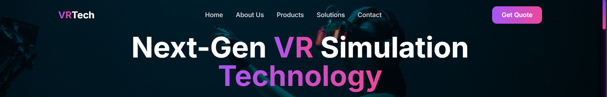
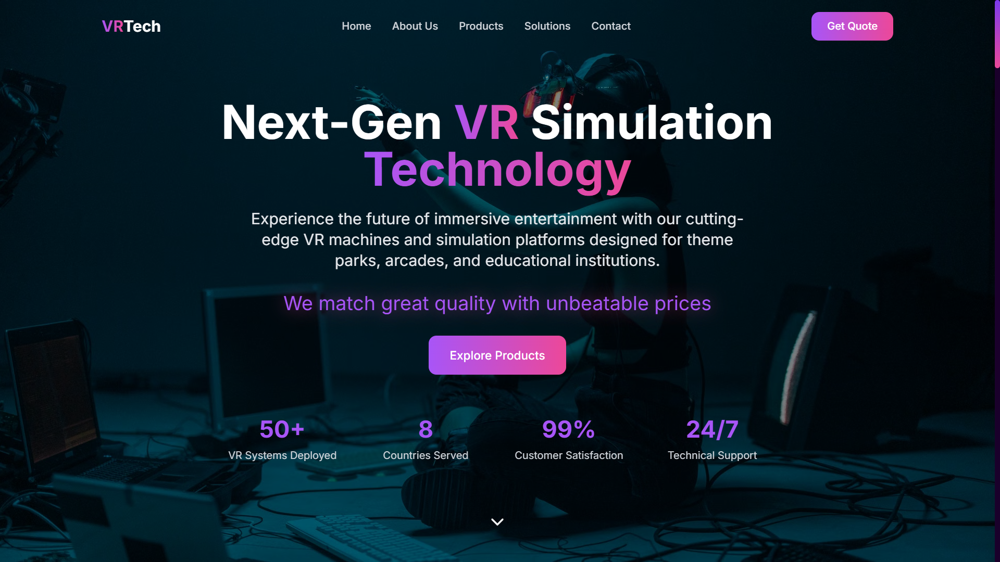
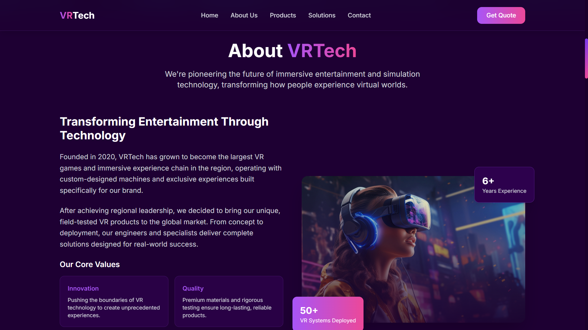
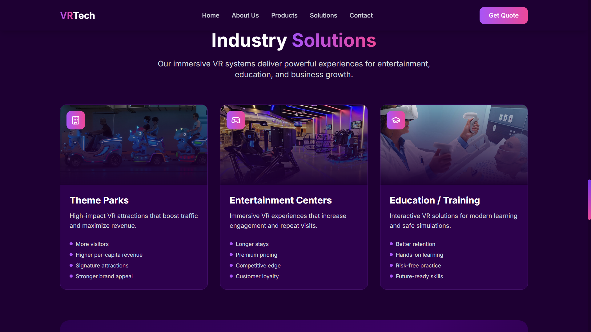
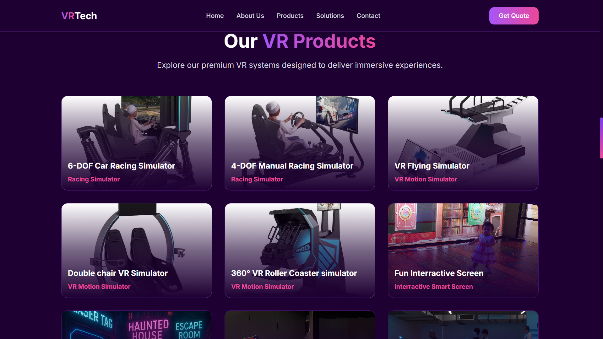
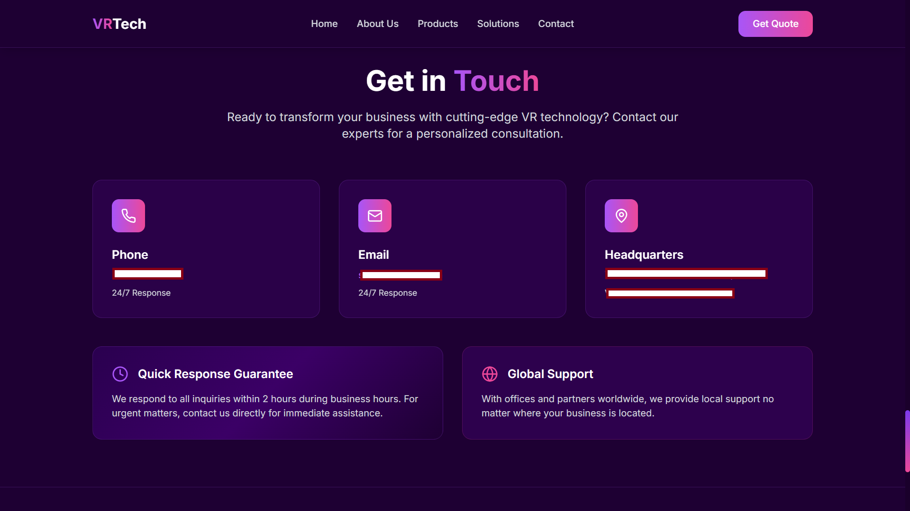
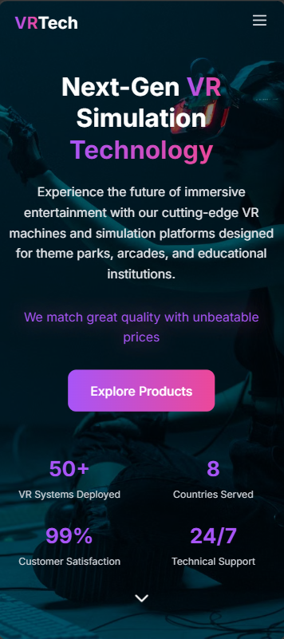

# 🌐 VR Tech Q8 Website



> A modern, responsive corporate website developed for **VR Tech Q8** using React, TypeScript, Vite, Tailwind CSS, and i18next.

---

# 📖 Overview

This project is the official website for **VR Tech Q8**, designed to showcase the company's products, solutions, and services through a clean, responsive, and multilingual user experience.

The website emphasizes performance, scalability, and accessibility while providing customers with downloadable product brochures and an intuitive navigation experience.

> **Note**
>
> The source code is proprietary and owned by the company. This repository is intended solely to showcase the project through screenshots and technical documentation.

---

# 🚀 Technologies

| Technology | Purpose |
|------------|---------|
| React 18 | Frontend Framework |
| TypeScript | Static Typing |
| Vite | Development & Build Tool |
| Tailwind CSS | Styling |
| React Router | Client-side Routing |
| i18next | Internationalization |
| React i18next | React Localization |
| Express.js | Lightweight Backend |
| Lucide React | Icons |
| ESLint | Code Quality |
| PostCSS | CSS Processing |
| Autoprefixer | Browser Compatibility |

---

# 🏗 Project Architecture

```text
VR TECH SITE
│
├── public/
│   ├── brochures/
│   │   └── product-1.pdf
│   ├── images/
│   └── products.json
│
├── src/
│   ├── components/
│   │   ├── Header.tsx
│   │   ├── Hero.tsx
│   │   ├── About.tsx
│   │   ├── Solutions.tsx
│   │   ├── Products.tsx
│   │   ├── Contact.tsx
│   │   └── Footer.tsx
│   │
│   ├── i18n/
│   │
│   ├── App.tsx
│   ├── main.tsx
│   └── index.css
│
├── package.json
├── vite.config.ts
└── README.md
```

---

# ✨ Features

- Responsive Design
- Mobile-First Layout
- Arabic & English Language Support
- Dynamic Product Catalog
- Downloadable PDF Brochures
- Modern User Interface
- Component-Based Architecture
- Fast Loading Performance
- Client-Side Routing
- Optimized Production Build

---

# 🌍 Website Sections

- 🏠 Hero
- ℹ️ About
- 💡 Solutions
- 📦 Products
- 📞 Contact
- 📄 Footer

---

# 📸 Screenshots

## Home Page



---

## About Section



---

## Solutions



---

## Products



---

## Contact



---

## Mobile Version



---

## Arabic Version


---

# 🌍 Internationalization

The website supports multiple languages using **i18next** and **React i18next**, providing a seamless experience for both Arabic and English users.

- 🇺🇸 English
- 🇰🇼 Arabic (RTL Support)

---

# 📦 Product Management

Product information is dynamically loaded from JSON, allowing easy updates without modifying application components.

Features include:

- Product specifications
- Product images
- Downloadable PDF brochures
- Scalable product management

---

# ⚡ Performance

- Built with **Vite** for fast development and optimized production builds
- Lightweight React components
- Responsive across all modern devices
- Optimized assets and routing
- Modular architecture for maintainability

---

# 👨‍💻 My Contributions

As the Frontend Developer, I was responsible for:

- Designing and implementing the complete user interface
- Building reusable React components
- Creating responsive layouts
- Integrating multilingual support (Arabic & English)
- Developing the dynamic product catalog
- Implementing downloadable product brochures
- Configuring React Router navigation
- Integrating Express.js backend services
- Optimizing website performance
- Preparing the project for production deployment

---

# 🔒 Source Code

The complete source code is **private** because it belongs to **VR Tech Q8**.

This repository is published solely to demonstrate the project's design, architecture, and development approach through screenshots.

---

# 🛠 Built With

- React
- TypeScript
- Vite
- Tailwind CSS
- React Router
- i18next
- React i18next
- Express.js
- Lucide React
- ESLint

---

# 📄 License

This repository is for portfolio purposes only.

The original source code, assets, branding, and implementation belong exclusively to **VR Tech Q8**.

No proprietary source code is included in this repository.
